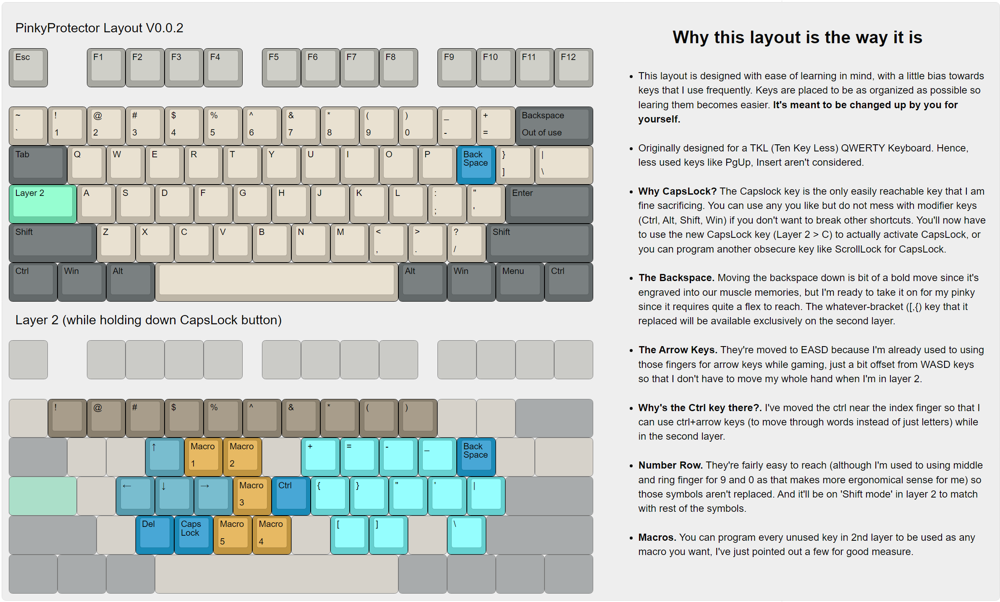

# Yeetus's Chest of AutoHotKey Scripts
Here are some AHK scripts that I use and don't wanna lose. Feel free to use them for your own endeavours.

***Used to use**. I do not use Windows anymore. I recommend [kmonad](https://github.com/kmonad/kmonad) instead of AHK whenever it's possible because it's works at a lower level and is much more performant but also lacks a lot of AHK's feature as a consequence. I've also uploaded kmonad config files.

## Before You Do
Before using these scripts, you should have an idea of [what AutoHotKey is](https://www.autohotkey.com/) and how it works (or kmonad if you're on linux). Feel free to refer to the [official docs](https://www.autohotkey.com/docs/v2) or YouTube tutorials.

## The PinkyProtector
Script to prevent extensive usage of the right pinky finger by creating a different layer of keys (on any keyboard, by holding CapsLock). 

The custom layer is designed by me to have the special characters typed by the pinky spread across the right-hand keys. Also accounts for other utilitles (like arrow keys) to make using keyboard easier for your hand. 

In very early stages but will likely keep updating this script as I use it and find ways to make it better. Here's the layout and some details.

#### To run the script automatically on startup:

- Paste the ahk script file (or a compiled executable) to `%AppData%\Microsoft\Windows\Start Menu\Programs\Startup`. 
- Or,
    - Create a txt file with `Start ""  "Directory to your script\script.ahk"` in it
    - Rename it to a `.bat` file
    - Paste the bat file to `%AppData%\Microsoft\Windows\Start Menu\Programs\Startup`

## QuickLittleTimer, QuLT
Just what the title says. I find myself using the default windows timer a lot and it is rather laboursome to get one started and then controlling it. So this AHK script creates a simple GUI timer on the screen that starts couting from the moment its activated (via a hotkey, preferably) until its stopped (Right Clicking on it, or another hotkey). Also added a fancy pause button (which would also be mapped to a hotkey, ofcourse).

 

## Credits
[Speed Optimization](https://www.autohotkey.com/boards/viewtopic.php?t=6413)

[Basis of method of using layers with AutoHotKey](https://www.autohotkey.com/boards/viewtopic.php?t=20661)

[Keyboard Layout Reference](http://www.keyboard-layout-editor.com/#/gists/016b11b6fc11fa1cb9306338a26e71f9)

