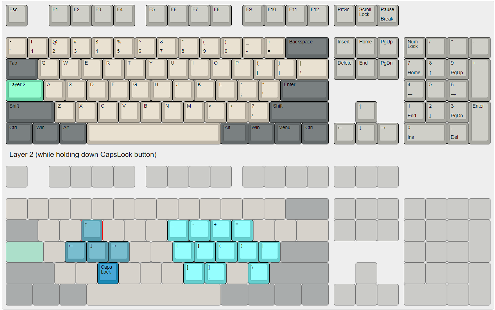

# Yeetus's Chest of AutoHotKey Scripts
AutoHotKey Scripts that I use and don't wanna lose. Feel free to use them for your own endeavours.

## The PinkyProtector
Script to prevent extensive usage of the right pinky finger by creating a different layer of keys (on any keyboard, by holding CapsLock). The custom layer is designed by me to have the special characters typed by the pinky spread across the right-hand keys. Also accounts for other utilitles (like arrow keys) to make using keyboard easier for your hand. Will likely keep updating this script as I use it and find ways to make it better. Here's the layout

